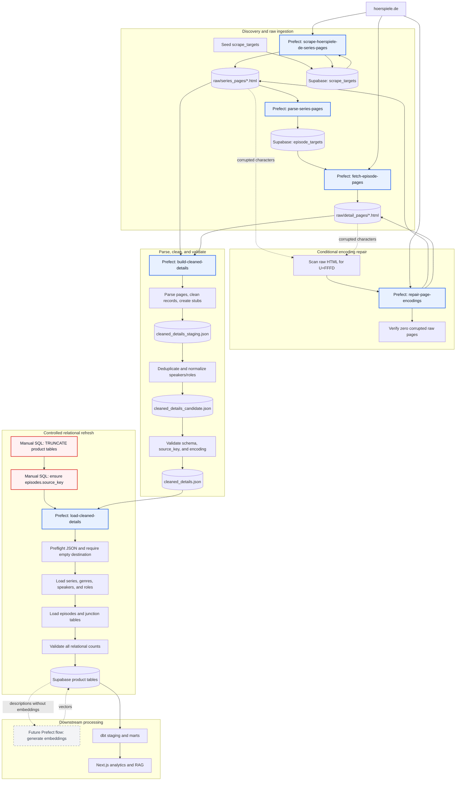

# Hörspiel Explorer pipeline

This diagram shows the current ingestion and processing pipeline. Rectangles
with a blue border are Prefect deployments. The database reset remains a
deliberate manual operation and is not part of a Prefect flow.

## Operational order for a full refresh

1. Run the discovery flows until series and episode targets are complete.
2. Run `repair-page-encodings` only when the raw-page scan finds `U+FFFD`.
3. Run `build-cleaned-details` and require successful artifact validation.
4. Empty the seven product tables manually; keep target tables intact.
5. Run `load-cleaned-details` and require matching post-load counts.
6. Generate embeddings, then build dbt models and downstream views.

The loader never truncates tables. If it fails partway through an initial full
refresh, empty the product tables again before restarting it.
