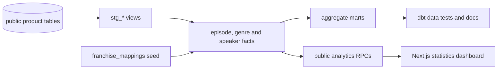

# Hörspiel Explorer analytics

This dbt project turns the normalized Supabase tables in `public` into a
documented analytics layer in the separate `analytics` schema.

## Lineage



Staging models standardize names and types without changing source data. The
fact marts retain the grains needed for year filtering, while aggregate marts
provide inspectable all-time results and portfolio-friendly lineage.

## Local commands

Set `DBT_HOST`, `DBT_USER`, `DBT_PASSWORD`, and optionally `DBT_PORT`,
`DBT_DBNAME`, `DBT_SSLMODE`, and `DBT_THREADS`. Then run:

```bash
dbt debug --project-dir hoerspiel_dbt --profiles-dir hoerspiel_dbt
dbt seed --project-dir hoerspiel_dbt --profiles-dir hoerspiel_dbt
dbt build --exclude resource_type:seed --project-dir hoerspiel_dbt --profiles-dir hoerspiel_dbt
dbt docs generate --project-dir hoerspiel_dbt --profiles-dir hoerspiel_dbt
```

The production path is the Prefect deployment `build-dbt-analytics`. It logs
every dbt step and publishes complete documentation artifacts to
`/data/hoerspiel-explorer/dbt_docs` only after a successful build.

## Franchise curation

`seeds/franchise_mappings.csv` contains the initial mappings for the largest
recognizable franchises in the current dataset. Matching uses normalized,
case-folded series names. Every series without a mapping remains visible as its
own franchise, so the seed never drops or guesses away records.
