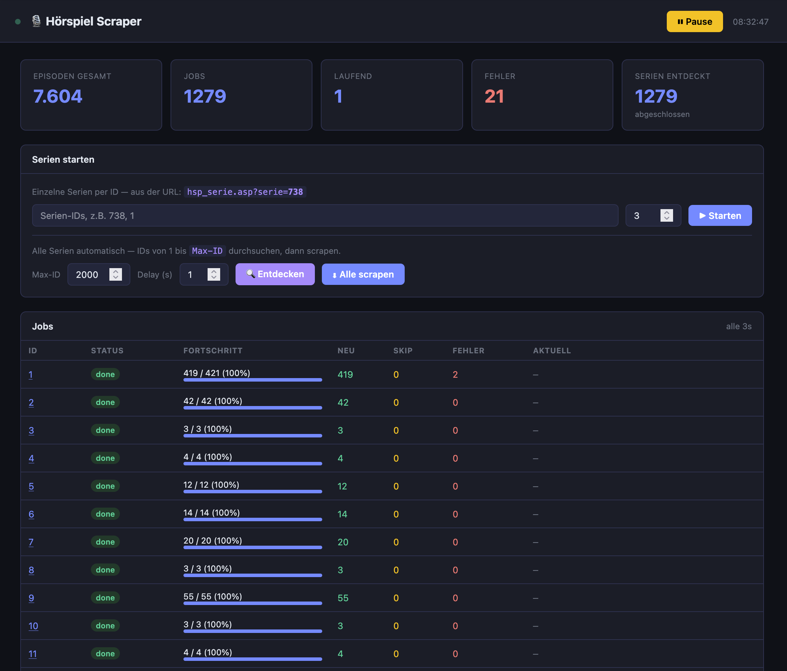

# Hörspiel Scraper

A Flask-based scraper dashboard for collecting audio drama metadata from [hoerspiele.de](https://www.hoerspiele.de).

## Dashboard



The dashboard runs on port **5123** and provides:

- **Live stats** — total episodes collected, active jobs, errors, discovered series
- **Single-series scraping** — enter one or more series IDs (from the URL `hsp_serie.asp?serie=<ID>`) to scrape them directly
- **Discovery + bulk scrape** — scan all IDs from 1 up to a configurable Max-ID to discover valid series, then scrape them all
- **Pause / Resume** — stop and continue the worker without losing progress
- **Jobs table** — per-job progress bar, new / skipped / error counts, and the currently active episode URL

## Architecture

```
app.py          Flask dashboard + REST API
worker.py       Background worker (discovery, scraping, pause/resume)
run_scraper.py  Entry point
templates/
  dashboard.html  Dark-mode UI with auto-refresh
```

## Running locally

```bash
docker compose up --build
```

The dashboard is then available at `http://localhost:5123`.

## Running in the stack (Docker Swarm)

```bash
docker stack deploy -c stack.yml hoerspiel
```

The stack exposes the dashboard via Traefik at the configured hostname.

## API endpoints

| Endpoint | Description |
|---|---|
| `GET /` | Dashboard UI |
| `GET /api/state` | Full worker state (jobs, counters) |
| `GET /api/summary` | Aggregated summary stats |
| `POST /api/pause` | Pause the worker |
| `POST /api/resume` | Resume the worker |
| `POST /api/scrape` | Start scraping specific series IDs |
| `POST /api/discover` | Start discovery up to Max-ID |
| `POST /api/scrape-all` | Scrape all discovered series |